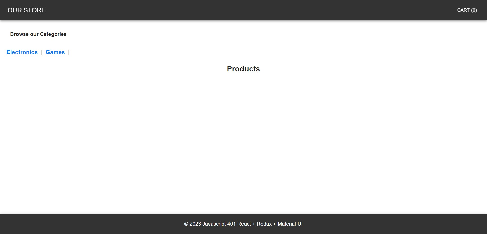

# Virtual Store

The Virtual Store is a web application built using React, Redux, and Material UI that simulates an online store. It allows users to browse product categories and view products associated with those categories.

## UML
.jpg)

## Features

- Display a list of product categories.
- Select a category to view products in that category.
- View detailed information about each product.
- Add products to the shopping cart.
- Responsive design for mobile and desktop.

## Technologies Used

- React: A JavaScript library for building user interfaces.
- Redux: A predictable state container for managing application state.
- Material UI: A popular React UI framework for designing responsive web applications.

## Project Structure

The project consists of the following components:

- `Header`: Displays the store name and logo.
- `Footer`: Shows copyright and contact information.
- `Categories`: Displays a list of product categories and allows users to select a category.
- `Products`: Displays a list of products associated with the selected category.
- Redux Store: Manages the state of categories, products, and the shopping cart.

## Usage

1. Clone the repository to your local machine.
2. Install dependencies using `npm install`.
3. Run the application using `npm run dev`.

