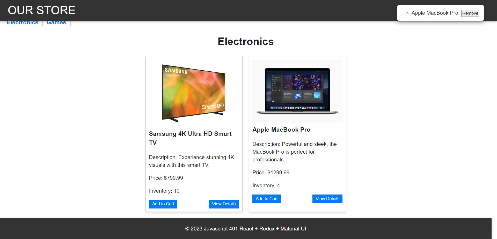
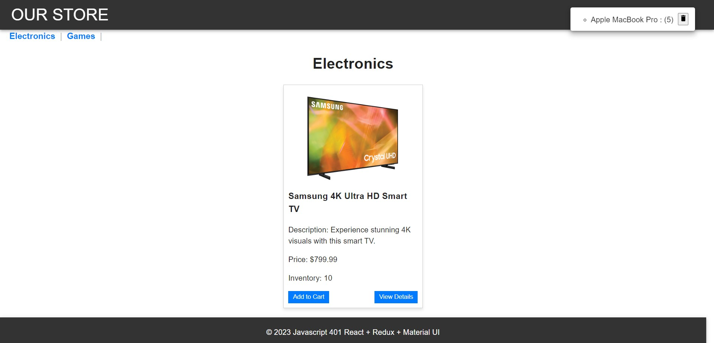
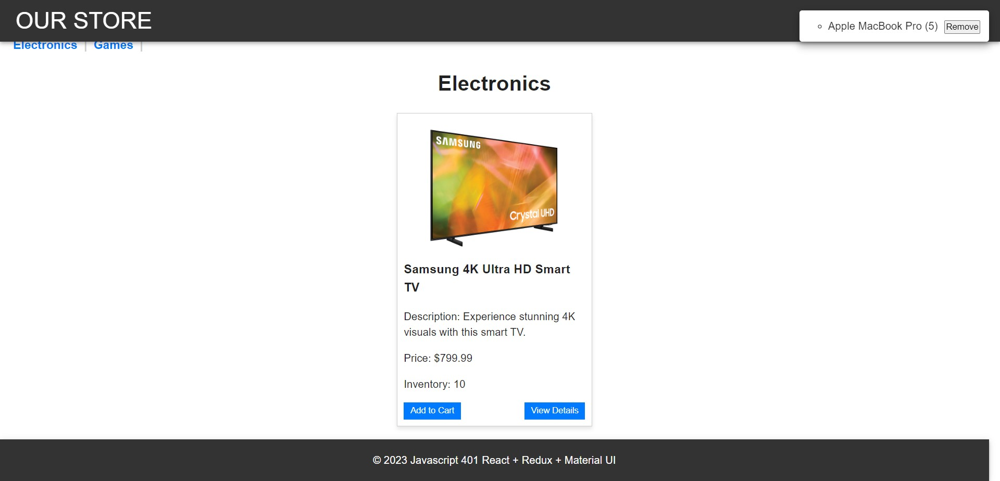

# Lab: Class 37

## Online Store Application

This is an online store application built with React and Redux, featuring categories, products, and a shopping cart.

### Categories

- State includes a list of categories and the active category.
- Each category has a normalized name, display name, and description.
- An action changes the active category, updating it in the reducer.

### Products

- State includes a list of all products.
- Each product has a category association, name, description, price, and inventory count.
- An action filters the product list based on the active category.
- An action reduces the stock count when a product is added to the cart.

### Cart

- State includes an array of products in the cart.
- An action adds a selected item to the cart.
- When the item is empty from the store it removes the item from the products!

## Application Architecture

- Material UI components are used for layout and styling.
- The header displays a "Cart" indicator.
- A <SimpleCart /> component shows items in the user's cart.
- Users can select a category to view products.
- Users can add products to their cart, which updates the cart indicator.
- The number in stock is reduced when a product is added to the cart.

## User Stories

- As a user, I can choose from products and add them to my shopping cart.
- As a user, I can see the products in my cart in a list on the side of the page.
- As a user, I can change the quantity of items in my cart.
- As a user, I can remove items from my shopping cart.

## Application Flow

1. User sees a list of categories.
2. Chooses a category and sees a list of products.
3. Clicks "Add to Cart" on any product.
4. Sees a list of all products in the <SimpleCart /> side menu.
5. Clicks the delete button on an item to remove it.
6. The cart total in the header updates.

## How to Run

- Start the development server: `npm run dev`.
- Open the application in your web browser on "http://localhost:5173/".

## Pictures as testing

